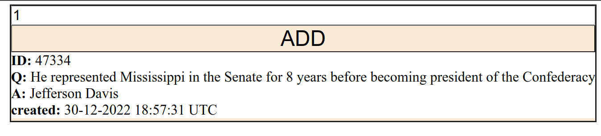
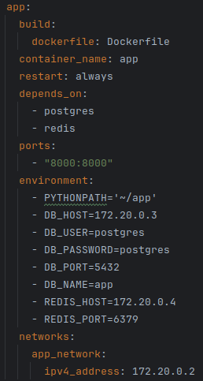

I've added redis for store previous added questions.

I've also created simple GUI with JS and HTML.

You could check it after running compose by 

    http://localhost:8000
You have just write the number in input and click ADD button

Config docker compose:

If you have an 8000 port bound 

you could select any free port by set it in mapping instead of PORT:

ports:
 
   - "PORT:8000"

You could start compose by 

    docker compose up -d

And stop it by

    docker compose down

If you want to remove all volumes and all images

    docker compose down -v --rmi all

Request Example:

request url: http://localhost:8000/api/v1/questions

request body: {
  "questions_num": 1
}

curl -X 'POST' \
  'http://localhost:8000/api/v1/questions' \
  -H 'accept: application/json' \
  -H 'Content-Type: application/json' \
  -d '{
  "questions_num": 1
}'

